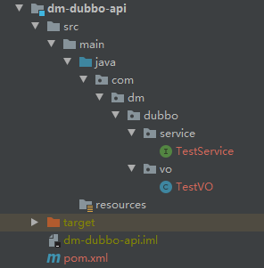
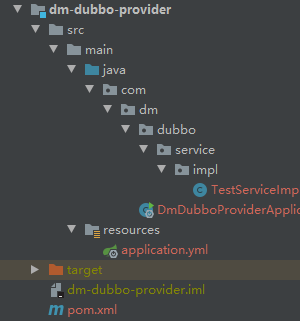
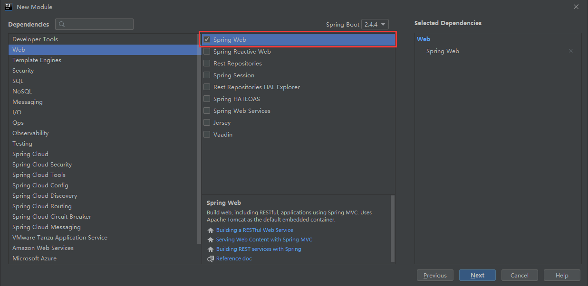
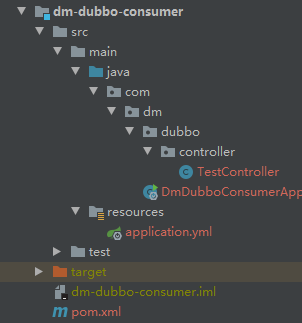

# SpringBoot+Dubbo+Zookeeper的分布式示例

## 一、环境搭建

- dubbo 2.7.7
- zookeeper 3.4.10   

## 二、创建工程

### 1.创建接口工程 dm-dubbo-api
   
```text
接口工程的作用：提供给消费者，用来调用方法
```

### 2.创建提供者工程 dm-dubbo-provider
**(1)工程目录**   
    
**(2)创建springboot工程**   
    
**(3)引入dubbo和zookeeper依赖**   
```xml
<dependencies>
    <!-- 分布式 -->
    <!-- https://mvnrepository.com/artifact/org.apache.dubbo/dubbo-spring-boot-starter -->
    <dependency>
        <groupId>org.apache.dubbo</groupId>
        <artifactId>dubbo-spring-boot-starter</artifactId>
        <version>2.7.7</version>
    </dependency>
    
    <!-- https://mvnrepository.com/artifact/com.101tec/zkclient -->
    <dependency>
        <groupId>com.101tec</groupId>
        <artifactId>zkclient</artifactId>
        <version>0.10</version>
        <exclusions>
            <exclusion>
                <groupId>org.apache.zookeeper</groupId>
                <artifactId>zookeeper</artifactId>
            </exclusion>
        </exclusions>
    </dependency>
    
    <!-- https://mvnrepository.com/artifact/org.apache.zookeeper/zookeeper -->
    <dependency>
        <groupId>org.apache.zookeeper</groupId>
        <artifactId>zookeeper</artifactId>
        <version>3.4.10</version>
        <exclusions>
            <exclusion>
                <groupId>org.slf4j</groupId>
                <artifactId>slf4j-log4j12</artifactId>
            </exclusion>
            <exclusion>
                <artifactId>log4j</artifactId>
                <groupId>log4j</groupId>
            </exclusion>
        </exclusions>
    </dependency>
    
    <!-- https://mvnrepository.com/artifact/org.apache.curator/curator-recipes -->
    <dependency>
        <groupId>org.apache.curator</groupId>
        <artifactId>curator-recipes</artifactId>
        <version>4.0.1</version>
        <exclusions>
            <exclusion>
                <groupId>org.apache.zookeeper</groupId>
                <artifactId>zookeeper</artifactId>
            </exclusion>
        </exclusions>
    </dependency>
    
    <!-- https://mvnrepository.com/artifact/org.apache.curator/curator-framework -->
    <dependency>
        <groupId>org.apache.curator</groupId>
        <artifactId>curator-framework</artifactId>
        <version>4.0.1</version>
    </dependency>
</dependencies>
```
**(4)配置文件**   
```yaml
# 端口号
server:
  port: 8088

# dubbo配置
dubbo:
  application:
    name: dubbo-provider
  protocol:
    port: 20880
    name: dubbo
  registry:
    address: zookeeper://127.0.0.1:2181
    timeout: 10000
  scan:
    base-packages: com.dm.dubbo.service
```
**(5)引入接口工程**   
```xml
<dependency>
    <groupId>com.dm</groupId>
    <artifactId>dm-dubbo-api</artifactId>
    <version>1.0.0-SNAPSHOT</version>
</dependency>
```
**(6)实现接口中的方法**   
```java
@DubboService()
public class TestServiceImpl implements TestService
{
	@Override
	public String getTestMsg()
	{
		return "hello world!";
	}
}
```
**(7)注解**
```text
@DubboService()
@DubboService(version = "1.0.0")
注解中可以加版本号，同时consumer引用的时候也需要加版本号。
```

### 3.创建消费者工程 dm-dubbo-consumer
**(1)工程目录**   
    
**(2)创建springboot工程**  
```text
与dm-dubbo-provider相同
``` 
**(3)引入dubbo和zookeeper依赖**      
```text
与dm-dubbo-provider相同
``` 
**(4)配置文件**   
```yaml
# 端口号
server:
  port: 8089

# dubbo配置
dubbo:
  application:
    name: dubbo-consumer
  protocol:
    port: 20880
    name: dubbo
  registry:
    address: zookeeper://127.0.0.1:2181
    timeout: 10000
```
**(5)引入接口工程**   
```text
与dm-dubbo-provider相同
```
**(6)调用接口中的方法**  
```java
@RestController
public class TestController
{
	@DubboReference()
	TestService testService;

	@GetMapping("/hello")
	public String hello()
	{
		String msg = testService.getTestMsg();
		System.out.println(msg);
		return msg;
	}
}
``` 
**(7)注解**   
```text
@DubboReference()
@DubboReference(version = "1.0.0")
如果provider中@DubboService()中加了版本号，那么@DubboReference()中也要加版本号。
```

## 三、dubbo-admin
GitHub地址：   
https://github.com/apache/dubbo-admin   
文档参考：   
https://github.com/apache/dubbo-admin/blob/develop/README_ZH.md